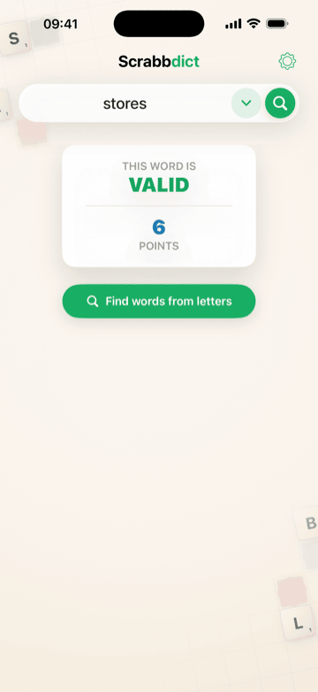
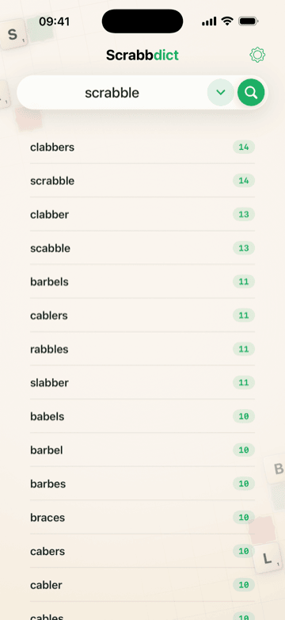
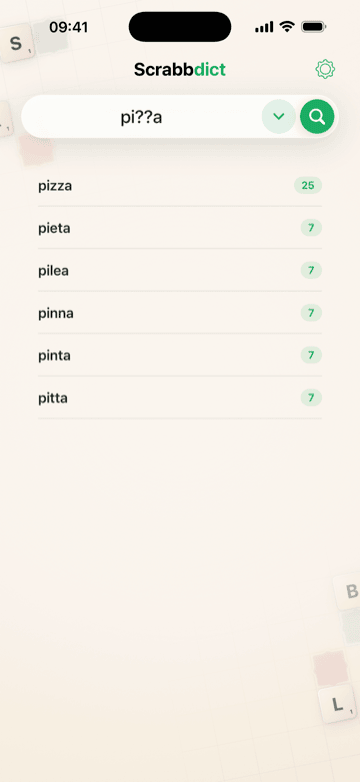
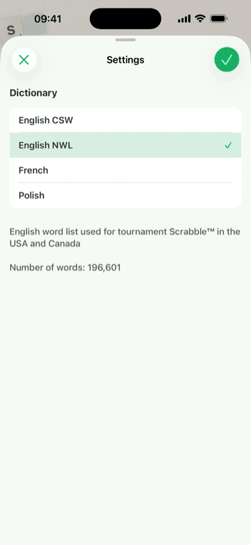

# Scrabbdict

[](https://codecov.io/gh/sochalewski/scrabbdict)

<p align="center">
  
  
  
  
</p>

Scrabbdict is an iOS dictionary helper for word games. It can validate a word, find words that can be built from a set of tiles, and search dictionaries with a simple `?` wildcard pattern.

[](https://apps.apple.com/pl/app/scrabbdict/id687530221)

The app is written in Swift and SwiftUI. State management uses [The Composable Architecture](https://github.com/pointfreeco/swift-composable-architecture), and analytics/crash reporting use Firebase.

## Legal Notice

© 2013-2026 Piotr Sochalewski

Scrabbdict is an independent, non-commercial hobby project. The developer does not derive profit from the application and has no affiliation, association, authorization, sponsorship, or endorsement from Hasbro, Mattel, NASPA Word List, Collins Coalition, Word Game Players’ Organization, Éditions Larousse, Polska Federacja Scrabble, Wydawnictwo Naukowe PWN or any other owner or publisher of the referenced word lists, trademarks, or related intellectual property.

All trademarks, service marks, trade names, word list names, and other protected designations referenced in or in connection with this application are the property of their respective owners. Their use is for identification and compatibility purposes only and does not imply any relationship with, or endorsement by, the respective owners.

## Licensing

The project source code is licensed under the Apache License, Version 2.0. See [LICENSE](LICENSE).

The maintainer may continue to sign and publish the official App Store version independently. The app name, icon, App Store listing, bundle identifier, and backend configuration are not covered by the open source license.

## Dictionary Data

This repository does not include full dictionaries because of licensing restrictions. It includes only small sample dictionaries: each sample contains approximately `0.0001` of the most popular words for the given language.

To build or test Scrabbdict with complete dictionary behavior, provide your own word lists and regenerate the DAWG files. You can also use the checked-in samples for development, but they are intentionally incomplete. Local tests are allowed to fail when run without full dictionaries.

The `.dictionaries` directory is a private submodule used by the maintainer. Public contributors should expect it to be unavailable and can use `.samples` or their own local word list archives instead.

## Repository Layout

- `Scrabbdict/` - the iOS app target.
- `Scrabbdict/Modules/` - app modules with SwiftUI views, TCA reducers, and module-local subviews.
- `Scrabbdict/Modules/App/` - app entry point and application delegate.
- `Scrabbdict/Modules/Scrabbdict/` - main dictionary search module.
- `Scrabbdict/Modules/Settings/` - settings module.
- `Scrabbdict/Services/` - dictionary loading, validation, analytics, Crashlytics, and local storage clients.
- `Scrabbdict/Models/` - app domain models such as `Language`, `Word`, and `SearchMode`.
- `Scrabbdict/Resources/` - bundled app resources, including asset catalogs, localization, Settings metadata, and dictionaries.
- `Scrabbdict/Resources/Dictionaries/` - generated binary dictionary files used by the app, copied from `.dictionaries/DAWG` or `.samples/DAWG`.
- `DAWGBuilder/` - command-line generator that converts zipped `.txt` word lists into compact `.dawg` files.
- `DAWGBuilder/RAW/` - local ignored source word list archives copied from `.dictionaries/RAW` or `.samples/RAW`.
- `.samples/` - checked-in sample `.dawg` and source `.zip` dictionary files used when the private dictionary submodule is unavailable.
- `ScrabbdictTests/` - unit, feature, and snapshot tests grouped by area.
- `Marketing/AppStore/Scrabbdict.butterkit/` - App Store screenshot project and exported PNG assets.
- `Scripts/dawg` - helper script that builds and runs `DAWGBuilder`.
- `Scripts/swiftformat-lint.sh` - Xcode build phase script that checks Swift formatting.
- `Makefile` and `.mise.toml` - local development tooling setup.

## Requirements

- macOS with Xcode installed.
- iOS 17.0 or newer deployment target.
- Swift Package Manager support through Xcode.
- A Firebase iOS app configuration file named `GoogleService-Info.plist`.
- Local development tools managed by [mise](https://mise.jdx.dev/): SwiftFormat and `git-format-staged`.

Xcode resolves the Swift Package Manager dependencies from `Scrabbdict.xcodeproj/project.xcworkspace/xcshareddata/swiftpm/Package.resolved`.

## Local Tooling

The Xcode project includes a `SwiftFormat Lint` build phase. Run the project setup once before building locally:

```sh
make init
```

That installs or verifies `mise`, installs the tools pinned in `.mise.toml`, and installs a pre-commit hook that formats staged Swift files.

Useful commands:

```sh
make format
make format-lint
```

## App Store Screenshots

App Store screenshots are maintained with [ButterKit](https://butterkit.app). The editable ButterKit project and exported PNG assets live under:

```text
Marketing/AppStore/Scrabbdict.butterkit
```

The exported screenshots are part of the repository assets and should be regenerated from the ButterKit project when App Store presentation copy, device frames, or screenshot content changes.

## Firebase Configuration

The app imports Firebase Analytics and Crashlytics. To build your own copy, you must provide your own Firebase configuration:

1. Create or open a Firebase project.
2. Add an iOS app in Firebase using the bundle identifier you intend to build with. The checked-in project currently uses `pl.sochalewski.Scrabbdict`.
3. Download `GoogleService-Info.plist`.
4. Place it at:

   ```text
   Scrabbdict/GoogleService-Info.plist
   ```

For public forks, do not commit production Firebase credentials or service configuration unless you intentionally want that Firebase project to be used by other builds. A common approach is to keep a local `GoogleService-Info.plist` and commit a sanitized example file instead.

Firebase Analytics and Crashlytics are used by the app runtime. Forks should use their own Firebase project and make an explicit decision about whether telemetry should remain enabled in their builds.

## Building the App

1. Clone the repository.
2. Run `make init`.
3. Add your own `Scrabbdict/GoogleService-Info.plist`.
4. Open `Scrabbdict.xcodeproj` in Xcode.
5. Let Xcode resolve packages.
6. Select the `Scrabbdict` scheme.
7. Select an iOS simulator or a signing-capable device.
8. Build and run from Xcode.

If you use a different Apple developer team or bundle identifier, update the target signing settings in Xcode before building for a device.

## Running Tests

Open the project in Xcode, select the `Scrabbdict` scheme, and run the test action. The active test plan includes unit tests, feature reducer tests, and snapshot tests. Performance tests are kept in the plan but skipped by default.

The test plan is stored at:

```text
ScrabbdictTests/Scrabbdict.xctestplan
```

Snapshot references are stored under:

```text
ScrabbdictTests/Snapshots/__Snapshots__/
```

Snapshot PNGs are tracked with Git LFS. When a UI change intentionally affects rendered output, update the relevant snapshot references and include those changes with the code that caused them.

The repository samples are not full dictionaries. Tests that depend on complete word-list coverage may fail locally until you provide full dictionaries and regenerate the corresponding `.dawg` files.

## How the DAWG Dictionaries Work

Scrabbdict does not search raw text files at runtime. Instead, each word list is compiled into a DAWG: a Directed Acyclic Word Graph. A DAWG is similar to a trie, but equivalent suffix subgraphs are merged, so common endings are stored once instead of repeated for many words.

The generator in `DAWGBuilder/` works broadly like this:

1. Read a UTF-8 `.txt` word list from a `.zip` archive, one word per line.
2. Parse an optional `[locale]` header on the first physical line. Any bracketed header is removed; its identifier must be nonempty and contain no whitespace, with `en_US_POSIX` used when the header is missing or invalid. Without a header, a nonempty first line remains a word, as does each subsequent nonempty line.
3. Extract the distinct scalars and order them using that locale.
4. Verify that the source words are already lexicographically ordered by the resulting scalar ranks, sorting them by those ranks only when necessary.
5. Insert each word into an incremental graph builder in that same encoded alphabet order.
6. Minimize completed branches by reusing previously seen equivalent nodes.
7. Write a compact little-endian binary file with:
   - a header containing magic/version/counts,
   - a small alphabet table,
   - an edge table.

The app loads generated `.dawg` files with memory-mapped `Data` when possible. Validation walks graph edges for an exact word. Tile search performs a depth-first traversal while consuming available letters. Pattern search treats `?` as a single-character wildcard.

At a high level, the DAWG v5 binary layout is:

- header: magic, version, word count, edge count, and alphabet count,
- alphabet table: the distinct `UInt16` Unicode scalar values used by edge labels, stored in the localized order encoded by the dictionary,
- edge table: each edge is a packed little-endian `UInt32` storing a 22-bit target (the first-edge index of the child node, `0` meaning no children), a word-terminating flag, a last-edge-of-node flag, and an 8-bit alphabet index.

There is no separate node table: a node is identified by the index of its first outgoing edge, and the root's edges start at index `0`.

The binary format is defined in `DAWGBuilder/DAWGFormat.swift`, written by `DAWGBuilder/DAWGBuilder.swift`, and read by `Scrabbdict/Services/DAWG.swift`.

### DAWG Result Ordering

DAWG files generated by this repository have two ordering invariants:

- the alphabet table contains distinct `UInt16` Unicode scalars ordered by the locale selected during generation, with scalar value breaking localized comparison ties,
- each node's edge block is stored by strictly ascending alphabet index.

The generator compares word scalars by their encoded alphabet indices rather than applying localized collation to whole strings. This keeps source ordering compatible with the scalar-prefix invariant required by incremental minimization. A correctly ordered source file is consumed directly; an unordered source receives the same rank-based ordering inside `DAWGBuilder`.

Both word-search methods traverse the stored edges depth-first and emit a word before visiting its descendants. Consequently, `DAWG.words(from:minLength:)` and `DAWG.words(matching:)` return words in the alphabet order encoded by the dictionary for the normalized entries used by the project. Consuming unavailable rack letters or following fixed pattern positions only skips branches, so it does not change the relative order of the remaining results.

Callers may rely on this contract. A stable sort by score alone preserves the encoded language-specific order between words with equal scores. Tests should compare DAWG result arrays directly rather than sorting them first.

`DAWG(url:)` treats generated and bundled dictionaries as trusted and does not revalidate their ordering invariants at runtime. Any externally generated or hand-authored `.dawg` file must preserve both invariants before its result order can be relied upon. Project tests validate bundled edge blocks and representative result ordering.

## Regenerating Dictionaries

Use the helper script from the repository root:

```sh
Scripts/dawg
```

That compiles `DAWGBuilder` with `xcrun swiftc` and writes generated dictionaries to:

```text
Scrabbdict/Resources/Dictionaries/
```

Generate only selected languages:

```sh
Scripts/dawg pl_OSPS
Scripts/dawg en_US_NWL fr_ODS
```

Use custom input or output directories:

```sh
Scripts/dawg --input-dir /path/to/word-lists --output-dir /tmp/dawg
```

Input files are matched by language/file stem. By default, `Scripts/dawg` reads from `DAWGBuilder/RAW`. For example, `pl_OSPS` expects:

```text
DAWGBuilder/RAW/pl_OSPS.zip
```

and produces:

```text
Scrabbdict/Resources/Dictionaries/pl_OSPS.dawg
```

To measure DAWG loading and search performance without resolving the full app package graph, run the standalone Release harness:

```sh
Scripts/dawg-performance
```

You can also compare two repository commits and their matching dictionary submodule commits:

```sh
Scripts/dawg-performance <base-ref> <compare-ref>
```

Use `current` as either ref to benchmark the working-tree DAWG reader and format sources with the current dictionaries:

```sh
Scripts/dawg-performance main current
```

Comparison runs compile each ref and the common adapter as isolated whole-module-optimized objects in both normal and crossed module assignments, then statically link each assignment into its runner so both sides share one ASLR slide without sharing codegen. Every workload replicate uses two fresh processes, one per assignment, and measures thread CPU time through short, locally balanced supercycles containing both ABBA and BAAB quartets. The workers split the supercycles and both measure the bridge supercycle, so its two module-specific values can be averaged and each assignment has equal local weight. The primary module assignment and first quartet orientation are balanced across the measurement timeline; in decision and confirm profiles, every workload is also position-balanced independently within each module-by-orientation cell. Each worker repeats its exact preflight immediately before one balanced warm-up supercycle. The warm-up uses the predecessor parity so it ends on the side that starts the worker's first timed supercycle. Workload values sharing a replicate index are averaged for aggregate metrics before the run-level estimate; do not compare absolute timings from separate runs, machines, or toolchains. With no refs, the harness defaults to a quick current/current A/A diagnostic without a verdict; it is explicitly not comparable across invocations.

Choose the measurement budget and artifact destination with command-line options:

```sh
Scripts/dawg-performance \
  --profile decision \
  --output-dir .build/dawg-performance/main-current-run \
  main current
```

`--profile quick` uses four replicate groups and 160 fresh module-paired workload processes and is diagnostic only, `decision` uses sixteen groups and 640 processes, and `confirm` uses thirty-two groups and 1,280 processes to independently confirm a borderline result. Decision and confirm use three logical 17 ms supercycles for `load`, seven 8 ms supercycles for `contains`, and five 10 ms supercycles for `words` and `pattern`, plus the duplicated bridge supercycle used to pair module assignments. This provides at least 200 ms of measured CPU per side and workload. Decision and confirm always use `overall` for the run-level verdict against the 1% practical margin, while every operation and workload retains its estimate and confidence interval. A significant overall ABBA-minus-BAAB bias above 0.5% suppresses the verdict as `unstable-order-effect`.

Dictionary selection is an advanced diagnostic. The default `--inputs matching` pairs each source ref with its dictionary commit. `shared-base` and `shared-compare` run both readers against one side's dictionaries to isolate reader changes; incompatible formats fail preflight. This also enables historical comparisons when one dictionary ref does not provide all five files in the fixed 20-workload manifest, provided the selected shared side is complete and compatible.

Local runs do not retain detailed artifacts by default. Pass `--save-artifacts` to keep a timestamped result bundle under `.build/dawg-performance/`, or `--output-dir` to keep it in an exact new/empty directory. A saved schema-version-2 bundle contains `metadata.json`, the frozen `calibration.tsv` profile, raw measurement legs with block, phase, module assignment, worker, supercycle, schedule, and leg-position coordinates in `blocks.tsv`, plus `summary.json` and `report.md`. Reports include median timed CPU per side and paired replicate, within-process MAD, and ABBA-minus-BAAB bias. `harness_hash` fingerprints the harness sources; the bundle metadata separately records the refs and source hashes, dictionaries, machine, OS, toolchain, power source, and observed thermal and Low Power Mode state.

The default console output is a compact XCTest-style comparison with Base, Compare, Delta, Change, and 95% CI columns. Base and Compare are normalized paired CPU estimates on the observed per-operation scale; Change and its confidence interval remain the decision metrics. When artifacts are saved, full sampling and stability diagnostics stay in `report.md` and `summary.json`.

The harness measures Release-optimized, hot-cache DAWG reader CPU performance on macOS. It is not a cold-I/O benchmark or an iOS-device benchmark, and it does not compile `Language+Extension.swift`; use `Scripts/points-performance` for `Language.points(for:)` changes. By default, a separate fresh-process retained-memory probe runs one sample per side and dictionary after timing, so it cannot disturb timed workloads. Set `DAWG_PERF_MEMORY_SAMPLES=0` to disable it or use a larger value, such as `5`, for a repeated median.

## Measuring Points Performance

To measure `Language.points(for:)` scoring performance on normalized scoring inputs without resolving the full app package graph, run:

```sh
Scripts/points-performance
```

You can also compare two repository refs:

```sh
Scripts/points-performance <base-ref> <compare-ref>
```

Use `current` as either ref to compare the current checkout, including uncommitted changes:

```sh
Scripts/points-performance main current
```

Canonical decomposition is handled at user-input boundaries and covered by validator tests. `Scripts/points-performance` focuses on the scoring hot path for precomposed dictionary results.

## Supported Dictionaries

The app currently references these language identifiers:

- `en_GB_CSW` - English CSW-style (formerly SOWPODS) word list.
- `en_US_NWL` - English NASPA-style (formerly OTCWL) word list.
- `en_WOW` - English WOW-style word list.
- `fr_ODS` - French ODS-style word list.
- `pl_OSPS` - Polish OSPS-style word list.

Names, descriptions, and language-specific behavior are defined in `Scrabbdict/Models/Language.swift`.

## Localization

User-visible translations are maintained in:

```text
Scrabbdict/Resources/Localizable.xcstrings
```

Keep locale-specific wording in the string catalog, but keep dictionary metadata that must stay identical across translations in code. In particular, dictionary word counts are defined as numeric values in `Scrabbdict/Models/Language.swift` and are injected into localized strings after locale-aware number formatting. Do not duplicate formatted word counts manually in each translation.

When updating dictionary names or descriptions, update all supported locales together (`en`, `fr`, and `pl`) and keep protected dictionary names, abbreviations, trademarks, and source names unchanged unless the underlying dictionary source changes. The string catalog comments mark terms that should not be translated.

## Third-Party Notices

User-visible third-party notices are maintained in:

```text
Scrabbdict/Resources/Settings.bundle/Root.plist
```

When Swift Package Manager dependencies used by the app at runtime change, update that file to match `Package.resolved`. Test-only dependencies, such as snapshot testing tools, do not need to appear in the user-visible Settings bundle unless they become part of the shipped app.

## Contributing Notes

See [CONTRIBUTING.md](CONTRIBUTING.md) for issue, pull request, formatting, testing, localization, accessibility, scoring and DAWG performance, and credential-handling guidelines.
