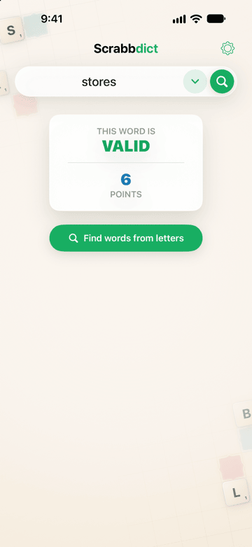
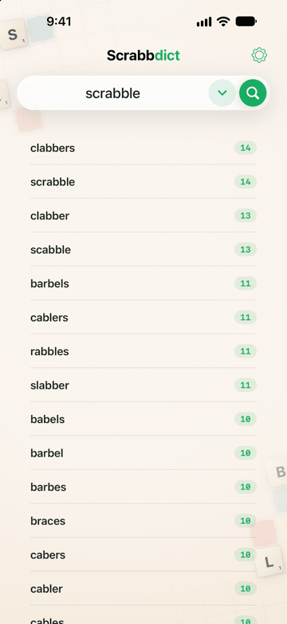
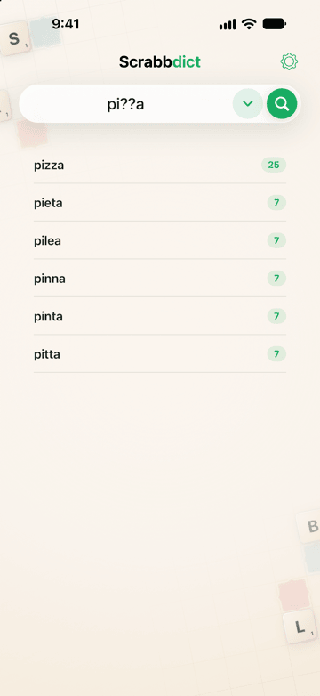
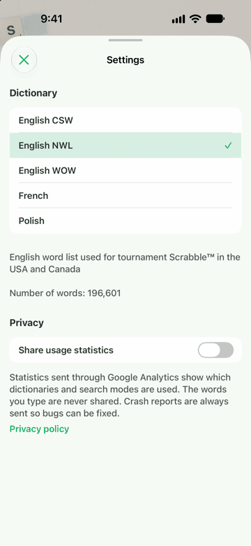

# Scrabbdict

[](https://codecov.io/gh/sochalewski/scrabbdict)

<p align="center">
  
  
  
  
</p>

Scrabbdict is an iOS dictionary helper for word games. It can validate a word, find words that can be built from a set of tiles, and search dictionaries with a simple `?` wildcard pattern.

[](https://apps.apple.com/us/app/scrabbdict/id687530221)

The app is written in Swift and SwiftUI with [The Composable Architecture](https://github.com/pointfreeco/swift-composable-architecture). Analytics and crash reporting use Firebase.

## Legal Notice

© 2013-2026 Piotr Sochalewski

Scrabbdict is an independent, non-commercial hobby project. The developer does not derive profit from the application and has no affiliation, association, authorization, sponsorship, or endorsement from Hasbro, Mattel, NASPA Word List, Collins Coalition, Word Game Players’ Organization, Éditions Larousse, Polska Federacja Scrabble, Wydawnictwo Naukowe PWN or any other owner or publisher of the referenced word lists, trademarks, or related intellectual property.

All trademarks, service marks, trade names, word list names, and other protected designations referenced in or in connection with this application are the property of their respective owners. Their use is for identification and compatibility purposes only and does not imply any relationship with, or endorsement by, the respective owners.

## Licensing

The project source code is licensed under the Apache License, Version 2.0. See [LICENSE](LICENSE).

The maintainer may continue to sign and publish the official App Store version independently. The app name, icon, App Store listing, bundle identifier, and backend configuration are not covered by the open source license.

## Dictionary Data

Full dictionaries are not included because of licensing restrictions. The checked-in `.samples` directory contains only about `0.0001` of the most popular words per language, so tests that depend on complete word lists may fail locally. For complete behavior, provide your own word lists and [regenerate the DAWG files](#regenerating-dictionaries).

The `.dictionaries` directory is a private maintainer submodule and is expected to be unavailable to public contributors.

Supported dictionaries are defined in `Scrabbdict/Models/Language.swift`: `en_GB_CSW`, `en_US_NWL`, `en_WOW`, `fr_ODS`, and `pl_OSPS`.

## Building

Requirements: macOS with Xcode, an iOS 17.0+ deployment target, and your own Firebase `GoogleService-Info.plist`.

1. Run `make init` once. It installs [mise](https://mise.jdx.dev/), the pinned tools from `.mise.toml`, and a pre-commit hook that formats staged Swift files.
2. Add an iOS app with your bundle identifier to your own Firebase project, then place its `GoogleService-Info.plist` at `Scrabbdict/GoogleService-Info.plist`. Do not commit production Firebase configuration in forks.
3. Open `Scrabbdict.xcodeproj`, select the `Scrabbdict` scheme, and build. Update signing settings if you use a different team or bundle identifier.

Analytics is opt-in: `Scrabbdict/Info.plist` disables collection by default, the app asks for consent on first launch, and the decision can be changed in Settings. Crashlytics stays enabled regardless of that decision.

## Testing

Run the test action of the `Scrabbdict` scheme. The `ScrabbdictTests/Scrabbdict.xctestplan` test plan includes unit, reducer, and snapshot tests; performance tests are skipped by default. Snapshot references in `ScrabbdictTests/Snapshots/__Snapshots__/` are tracked with Git LFS.

## How the DAWG Dictionaries Work

Each word list is compiled into a DAWG (Directed Acyclic Word Graph): a trie whose equivalent suffix subgraphs are merged. The format is defined in `DAWGBuilder/DAWGFormat.swift`, written by `DAWGBuilder/DAWGBuilder.swift`, and read by `Scrabbdict/Services/DAWG.swift`.

`DAWGBuilder` generates a dictionary as follows:

1. Read a UTF-8 word list, one word per line, from a raw `.txt` file or a `.txt` entry in a `.zip` archive.
2. Parse an optional `[locale]` header on the first physical line. Any bracketed header is removed; its identifier must be nonempty and contain no whitespace, with `en_US_POSIX` used when the header is missing or invalid. Without a header, a nonempty first line remains a word, as does each subsequent nonempty line.
3. Extract the distinct scalars and order them using that locale.
4. Verify that the source words are already ordered by the resulting scalar ranks, sorting them by those ranks only when necessary.
5. Insert words into an incremental builder in that encoded alphabet order, reusing equivalent completed nodes.
6. Write a compact little-endian binary file.

The DAWG v5 binary layout is:

- header: magic, version, word count, edge count, and alphabet count,
- alphabet table: the distinct `UInt16` Unicode scalar values used by edge labels, in the localized order encoded by the dictionary,
- edge table: each edge is a packed little-endian `UInt32` storing a 22-bit target (the first-edge index of the child node, `0` meaning no children), a word-terminating flag, a last-edge-of-node flag, and an 8-bit alphabet index.

There is no separate node table: a node is identified by the index of its first outgoing edge, and the root's edges start at index `0`.

The app memory-maps `.dawg` files. Validation walks edges for an exact word, tile search traverses depth-first while consuming available letters, and pattern search treats `?` as a single-character wildcard.

### DAWG Result Ordering

Generated DAWG files have two ordering invariants:

- the alphabet table contains distinct `UInt16` Unicode scalars ordered by the locale selected during generation, with scalar value breaking localized comparison ties,
- each node's edge block is stored by strictly ascending alphabet index.

The generator compares word scalars by their encoded alphabet indices rather than applying localized collation to whole strings, which keeps source ordering compatible with incremental minimization.

Both search methods traverse edges depth-first and emit a word before its descendants, so `DAWG.words(from:minLength:)` and `DAWG.words(matching:)` return words in the dictionary's encoded alphabet order. Skipped branches do not change the relative order of the remaining results. Callers may rely on this: a stable sort by score alone preserves the language-specific order between equal scores, and tests should compare result arrays directly without sorting.

`DAWG(url:)` trusts generated and bundled dictionaries and does not revalidate these invariants at runtime. Externally generated `.dawg` files must preserve both invariants for their result order to be reliable.

## Regenerating Dictionaries

```sh
Scripts/dawg
Scripts/dawg pl_OSPS en_US_NWL
Scripts/dawg --input-dir /path/to/word-lists --output-dir /tmp/dawg
```

By default, the script reads `<language>.zip` or `<language>.txt` from `DAWGBuilder/RAW/` (copied from `.dictionaries/RAW` or `.samples/RAW`) and writes `<language>.dawg` to `Scrabbdict/Resources/Dictionaries/`.

## Performance Benchmarks

Both harnesses compile standalone Release builds without resolving the app package graph:

```sh
Scripts/dawg-performance main current
Scripts/points-performance main current
```

`current` refers to the working tree, including uncommitted changes. `Scripts/dawg-performance` reports a paired `overall` estimate with a 95% confidence interval and a run-level verdict against a 1% practical margin; absolute timings from separate runs, machines, or toolchains are not comparable. Run either script with `--help` for profiles, dictionary input modes, and artifact options.

## Contributing

See [CONTRIBUTING.md](CONTRIBUTING.md) for issues, pull requests, code style, localization, accessibility, performance, and dependency notice guidelines.
